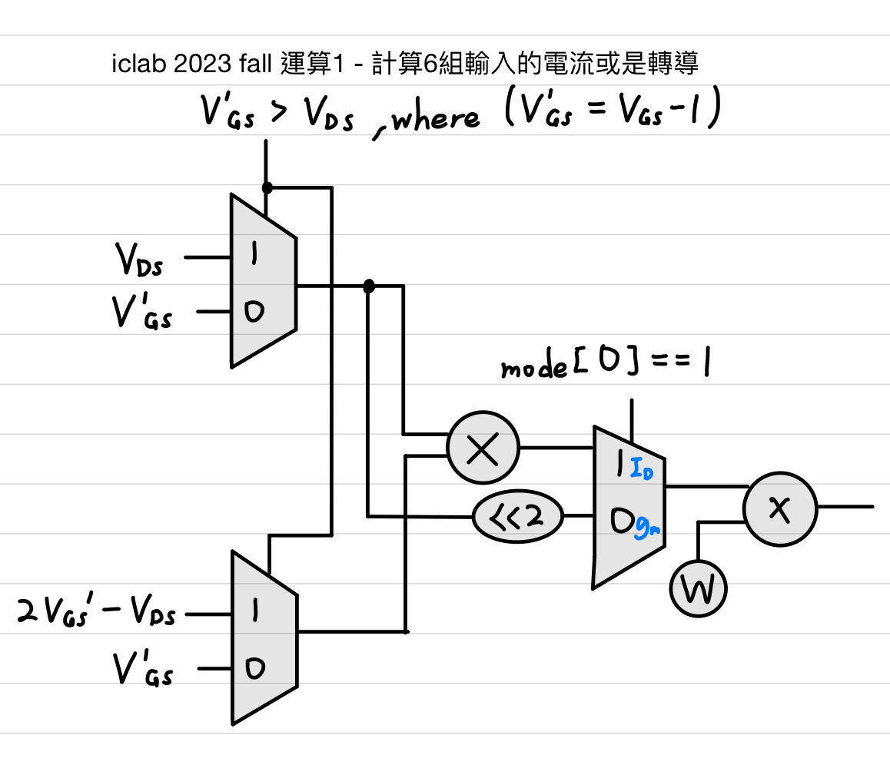

# iclab 01 Supper MOSFET Calculator(SMC)
- 時間 : 第2周 2023/09/20(三) - 2023/09/25(一)
- GitHub的Latex數學式會跑掉，請看[HackMD文檔](https://hackmd.io/@HsuChiChen/iclab01)。

## 成績
- 功能正確性 70%
- 效能 : area 30%
- cycle time固定20ns、只能使用組合電路

我的面積`39467` um^2，效能排名`26`% (`39/149`)，分數`92.35`，至於best code的面積是`30496` um^2。

## 規格
跟2021 fall題目幾乎一樣，題目很長原以為很難，但其實大致上分為3個運算，照著刻好運算即可。
### 運算1 - 計算6組輸入的電流或是增益
判定MOS為triode mode時

$$
V_{GS} - 1 > V_{DS}
$$

電流與增益計算公式如下

$$
\begin{align*}
I_{D} &= \frac{1}{3} \cdot W \cdot \left( 2(V_{GS} - 1)V_{DS} - V_{DS}^2 \right)\\
g_{m} &= \frac{2}{3} \cdot W \cdot V_{DS}\\
\end{align*}
$$

判定MOS為saturation mode時

$$
V_{GS} - 1 \leq V_{DS}
$$

電流與增益計算公式如下

$$
\begin{align*}
I_{D} &= \frac{1}{3} \cdot W \cdot (V_{GS} - 1)^2\\
g_{m} &= \frac{2}{3} \cdot W \cdot (V_{GS} - 1)
\end{align*}
$$

### 運算2 - 將六組運算結果由大排至小

### 運算3 - 計算平均值
根據2-bit選擇訊號線選擇合適運算。<br>
在`mode[0] = 1`是計算電流的前3大或是後3小值的加權平均值

$$
\begin{align*}
\text{Top 3 : } I_{avg} &= \frac{1}{12} \cdot (3 \times n_0 + 4 \times n_1 + 5 \times n_2) \quad (\text{mode}[1] = 1)\\
\text{Bottom 3 : } I_{avg} &= \frac{1}{12} \cdot (3 \times n_3 + 4 \times n_4 + 5 \times n_5) \quad (\text{mode}[1] = 0)
\end{align*}
$$

在`mode[0] = 0`是計算增益的前3大或是後3小值的平均值

$$
\begin{align*}
\text{Top 3 : } g_{avg} &= \frac{1}{3} \cdot (n_0 + n_1 + n_2) \quad (\text{mode}[1] = 1)\\
\text{Bottom 3 : } g_{avg} &= \frac{1}{3} \cdot (n_3 + n_4 + n_5) \quad (\text{mode}[1] = 0)
\end{align*}
$$

## 功能性與優化思路
### 運算1 - 計算6組輸入的電流或是增益
觀察以下4個運算公式(電路中的datapath)與條件式(電路中的control unit)

$$
\begin{align*}
I_{D} &= \frac{1}{3} \cdot W \cdot \left( 2(V_{GS} - 1)V_{DS} - V_{DS}^2 \right), \text{when } V_{GS} - 1 > V_{DS}\\
I_{D} &= \frac{1}{3} \cdot W \cdot (V_{GS} - 1)^2\\
g_{m} &= \frac{2}{3} \cdot W \cdot V_{DS}, \text{when } V_{GS} - 1 > V_{DS}\\
g_{m} &= \frac{2}{3} \cdot W \cdot (V_{GS} - 1)
\end{align*}
$$

可以發現
- 均出現 $W$ 項，可以移到運算1最後再相乘。
- 均出現"除以3"，除法器的電路面積很大和計算時間很長，**在數位電路設計中，要盡可能避免使用到除法**，可以把"除以3"運算放到運算3選擇最大或是最小的3個值後再做運算，如此就可以把除法器原本個別6個輸入需要6個除法器，降低為3個除法器。
- 均出現 $V_{GS} - 1$ 可以先計算這個結果。
- 在 $I_D$ 運算還需要一個乘法器，分別做 $(V_{GS} - 1)$ 的平方與 $2(V_{GS} - 1)V_{DS} - V_{DS}^2 = V_{DS} \cdot [2(V_{GS} - 1) - V_{DS}]$ 。

因此假設 $V_{OV} = V_{GS} - 1$ ，上述公式可以共用硬體運算變成

$$
\begin{align*}
I_{D}' &= V_{DS} \cdot [2V_{OV} - V_{DS}], \text{when } V_{OV} > V_{DS}\\
I_{D}' &= V_{OV} \cdot V_{OV}\\
g_{m}' &= V_{DS} \cdot 2, \text{when } V_{OV} > V_{DS}\\
g_{m}' &= V_{OV} \cdot 2
\end{align*}
$$

畫成電路與程式碼即為<br>


```verilog
assign V_GS_minus1 = V_GS - 3'b1;
always @(*) begin
	if(V_GS_minus1 > V_DS) begin
		operand1 = V_DS;
		operand2 = 2 * V_GS_minus1 - V_DS;
	end else begin
		operand1 = V_GS_minus1;
		operand2 = V_GS_minus1;
	end
end

assign mul_result = operand1 * operand2;
assign Id_gm_temp = (mode0)? mul_result : 2 * operand1;
assign Id_gm = W * Id_gm_temp;
```

### 運算2 - 將六組運算結果由大排至小
上網搜尋"6-input sorting network"，我找其中一個具有對稱性的網路，推測合成面積會比較好看。<br>


### 運算3 - 計算平均值
1. 用MUX選擇要輸出最大的3項或是選擇最小的3項。
2. 做運算1沒完成的"除以3"
3. 選擇要"三個數乘以各自權重3、4、5再除以4"或是"三個數相加"。
4. 全部除以3。
PS : 經過測試(看合成報告`02_SYN/syn.log`是否符合預期)，Design Compiler會自己優化常數乘法為位移運算，因此常數乘法不需要寫位移運算。

## 心得
可能我沒什麼寫過HDL的經驗，iclab 01最簡單的一次寫得很普通，合成面積超大，請實驗室同屆和巴友阿菠幫我code review，抱別人大腿，我主要有2個問題
1. 電流 $I_D$ 計算公式可以分成先用MUX選擇運算元A和運算元B，再做乘法，這樣就可以省掉一個乘法器。
2. 電流 $I_D$ / 增益 $g_m$ 計算公式在6個重複module都要除以3，這個運算可以移到排序後才除以3，這樣使用到的除法器個數從6個變成只要除以結果的3個。

還有以下學習重點
- lab01只有組合電路，沒有clock訊號，頂多做`+-*/`的運算，所以要盡可能減少`+-*/`的運算，尤其是除法器面積很大，其次是乘法器，要盡量少用。
- 學到怎麼看合成報告`02_SYN/syn.log`，實際上Design Compiler合成出來電路的結果，是不是跟對應我預期的HDL代碼的行為一樣。
- 常數的乘法不太需要在程式上優化，Design Compiler會自動優化，有時候Design Compiler優化的效果反而比自己寫的還好，把邏輯寫得簡單讓Design Compiler更容易優化才是更好的寫法。

因為iclab01很簡單，大家面積都集中在3萬 - 4萬，大家開始會斤斤計較design compiler多一兩千的合成面積，像是可能把always block順序顛倒，面積就意外變小的神奇事，但在乎這種小事很沒有意義，我們也不知道design compiler內部是怎麼優化的。

我覺得第一次lab不要放在多心思在上面，大家的演算法都大同小異，把重點放在之後的lab比較重要，尤其是iclab04, iclab05。

## 優化版本紀錄
### 優化總結
- 第1版 - 功能正確，但面積將近7萬十分嚇人。
- 第2版 - 使用常數除法即可，Design Compiler會自動優化，不需要再寫位移。
- 第3版 - 在運算3，原本將結果與`mode[1]`做bitwise XOR，再選取最大3者即可，但發現這種方法多此一舉沒有比較好。
- 第6、7版 - 在運算1，將 $W$ 項移到最後，並將前面的乘法運算合併。
- 第8版 - 將運算1的除以3移至運算3。
- 第9、10版 - 乘法與除法改使用loopup table，就是將所有條件列出來。事後看best code主要亮點是 - 列出運算1的loopup table，我的code替換成使用best code的calculator module，合成面積39467 -> 32841，但我推測loopup table只適用於少量的結果(大概輸出4-bit)，如果輸出的可能性一增加，loopup table的優點變會消失。

### 第1版
functionality pass, synthesis area `69125`.

### 第2版
reduce to 1 line in final average calculating, it will get better area `66737`.

### 第3版
change the sorting circuit with six inputs and six outputs instead of the method provided by the GitHub user `reglin2000`, it will get better area `65503`.

### 第4版
1. use nested if-else loop, instead of 2-bit case statement
2. reduce signal `Id_gm_temp` from 9 bits to 8 bits.
, it will get better area `60277`.

### 第5版
use for loop call calculator module 5 times

### 第6版
multiply `W` together in MOS calculator , it will get better area `48199`.

### 第7版
use MUX to select operand1 and operand2, reduce multiplier from 18 to 12, it will get better area `47464`.

### 第8版
move operation `divided by 3` from MOS calculator to the result 0 ~ 2, it will get better area `43146`.

### 第9版
replace a 4-bit by 3-bit multiplier with a lookup table, it will get better area `41184`.

### 第10版
replace an 8-bit divided by 3 divider with a lookup table, it will get better area `39467`.

### 第11版
resolve the overflow that occurs in the lookup table of a 4-bit by 3-bit multiplier

### 第12版
code formatting